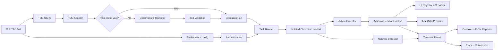

# Tài liệu kiến trúc

## 1. Mục tiêu thiết kế

Hệ thống là một automation engine data-driven:

```text
TMS Task ID → TMS testcases → ExecutionPlan → Playwright runtime → Result/Artifacts
```

Các nguyên tắc bắt buộc:

- Không tạo một `.spec.ts` cho mỗi testcase TMS.
- Runtime không hiểu trực tiếp câu tiếng Việt tự do.
- Không đoán action, selector hoặc application API khi thiếu dữ liệu.
- Action và assertion là hai lớp độc lập.
- Không biến `NEED_MAPPING`, `NEED_DATA` hoặc `PARTIAL` thành `PASS`.
- Selector, test data và compiler đều có extension point riêng.

## 2. Sơ đồ tổng thể



## 3. Cấu trúc source

```text
src/
├── auth/          # Chuẩn bị login/storage state
├── compiler/      # IR schema, deterministic parser, normalizer, cache
├── config/        # Đọc và validate environment
├── data/          # TestDataProvider và implementation tĩnh
├── reporting/     # Console summary và JSON report
├── runtime/       # Task runner, executor, handlers, assertions, network
├── tms/           # HTTP client, raw adapter và domain types
├── ui/            # Registry, aliases, locator resolver, page mappings
└── utils/         # Utility không phụ thuộc domain

scripts/
├── run-task.ts    # Entry point npm run test:task
└── check-tms.ts   # Chỉ kiểm tra kết nối TMS

tests/
└── task.spec.ts   # Playwright Test integration entry
```

## 4. TMS boundary

`TmsClient` chỉ chịu trách nhiệm HTTP và authentication. Nó gọi đúng một endpoint:

```http
GET /api/tasks/task/{TASK_ID}/testcases
```

Payload được đưa qua adapter trước khi vào core. Adapter:

- validate shape cơ bản bằng Zod;
- loại các field như history, watcher, createdBy;
- normalize null/unknown thành text an toàn;
- trả `TmsTestCase[]` strongly typed.

Nhờ boundary này, thay đổi payload TMS chỉ ảnh hưởng `src/tms`, không lan vào runtime.

## 5. Compiler và intermediate representation

### Vì sao cần ExecutionPlan?

Playwright runtime chỉ nhận discriminated union như:

```ts
{ type: 'SELECT', target: 'Tình trạng QA', value: 'Tái chế' }
```

Runtime không parse câu `Click vào dropdown...`. Điều này giúp execution deterministic, log/report rõ ràng và unit-test compiler không cần browser.

### Pipeline compiler

1. Normalize Unicode, quote và whitespace.
2. Parse action/data bằng pattern tường minh.
3. Parse expected result thành assertion riêng.
4. Extract một phần business rule từ description.
5. Normalize dependency an toàn.
6. Đánh dấu phần không hiểu là `CUSTOM/NEED_MAPPING`.
7. Validate toàn bộ plan bằng Zod.

### Dependency normalization

Normalizer chỉ reorder khi có bằng chứng đủ mạnh, ví dụ:

- Có đúng một `OPEN_MODAL` và nó nằm sau input action.
- Có đúng một `SEARCH` nằm trước các filter action và không có assertion xen giữa.

Nếu có nhiều modal/search hoặc assertion làm dependency mơ hồ, plan nhận unsupported reason thay vì reorder tùy tiện.

### Cache

`CompiledPlanCache` tạo SHA-256 fingerprint từ title, description, pre/post-condition và steps. Cache chỉ được dùng khi fingerprint và schema đều hợp lệ.

## 6. UI Registry và resolver

Registry tách tên business khỏi selector:

```text
"Tình trạng QA"
"Trạng thái QA"
"QA Status"
        ↓
orderSearch.qaStatus
        ↓
label / role / testId locator candidates
```

Alias dùng exact normalized matching; không fuzzy matching rộng để tránh click nhầm.

Thứ tự locator được khuyến nghị:

1. `getByRole`
2. `getByLabel`
3. `getByPlaceholder`
4. `getByTestId`
5. stable CSS

Hai lỗi mapping được phân biệt:

- `UnknownUiTargetError`: chưa đăng ký target/alias.
- `UiElementNotFoundError`: đã đăng ký nhưng không locator nào match DOM.

Cả hai dẫn tới `NEED_MAPPING`, không bị coi là application bug.

## 7. Runtime và action handlers

`executePlan` duyệt action tuần tự và dispatch qua `actionHandlers` map. Không có switch lớn trong executor.

Mỗi handler:

- nhận một typed action và runtime context;
- log loại action;
- resolve UI/test data khi cần;
- thực thi Playwright;
- trả status, expected và actual;
- hoặc throw lỗi để executor lưu evidence.

Runtime hiện hỗ trợ:

- Navigation/modal: `OPEN_PAGE`, `OPEN_MODAL`.
- Interaction: `CLICK`, `SELECT`, `FILL`, `FILL_SEARCH_FIELDS`, `SEARCH`.
- Network/download: `WAIT_FOR_RESPONSE`, `DOWNLOAD`, `ASSERT_DOWNLOAD`.
- UI assertion: `ASSERT_VISIBLE`, `ASSERT_HIDDEN`, `ASSERT_TEXT`, `ASSERT_VALUE`.
- Business assertion: `ASSERT_SEARCH_RESULT`, `ASSERT_RESULT_INCLUDED`, `ASSERT_RESULT_EXCLUDED`.
- Extension/fallback: `CUSTOM`.

## 8. Assertion model

Action thành công không đồng nghĩa testcase pass. Ví dụ:

```text
CLICK Search → chỉ chứng minh nút đã được click
ASSERT_SEARCH_RESULT → chứng minh included/excluded order đúng
```

Business assertion yêu cầu expectation từ `TestDataProvider`. Nếu không có dữ liệu để chứng minh kết quả:

- thiếu dataset: `NEED_DATA`;
- chỉ kiểm tra được một phần: `PARTIAL`;
- actual khác expectation đã biết: `FAIL`.

## 9. Test data provider

Interface hiện có ba trách nhiệm:

```ts
resolveFields(fields, hints?)
findOrder(criteria)
getSearchExpectation(criteria)
```

`StaticTestDataProvider` đọc `TEST_DATA_JSON`. Đây là implementation POC, không phải nơi phù hợp để chứa dataset lớn.

Extension tương lai có thể lấy dữ liệu từ:

- application API đã được tài liệu hóa;
- database fixture/seed;
- test-data service;
- snapshot do môi trường test tạo ra.

Provider mới không yêu cầu sửa compiler hoặc executor core nếu giữ nguyên interface.

## 10. Authentication và browser isolation

Auth được chuẩn bị một lần trước khi chạy danh sách testcase:

- `none`: không chuẩn bị session.
- `storage-state`: kiểm tra và dùng file có sẵn.
- `form`: login một lần, sau đó ghi storage state.

Mỗi testcase chạy trong browser context riêng và có thể dùng chung storage state. Cách này giữ đăng nhập nhưng hạn chế state leakage giữa testcase.

## 11. Network observability và bảo mật

Collector chỉ ghi:

- HTTP method;
- URL với sensitive query parameter đã redact;
- response status;
- duration;
- request failure flag.

Không ghi request/response body, cookie, password hoặc authorization header mặc định.

Testcase không pass sẽ giữ trace và screenshot. Tên thư mục artifact được sanitize trước khi tạo đường dẫn.

## 12. Result aggregation

Mỗi action có `ActionExecutionResult`; mỗi testcase có `TestCaseExecutionResult`; toàn task có `TaskExecutionReport`.

Độ ưu tiên khi gộp status:

```text
PASS < SKIP < PARTIAL < NEED_DATA < NEED_MAPPING < FAIL
```

Engine dừng testcase tại action đầu tiên không thể tiếp tục an toàn. Các testcase khác của task vẫn được chạy tuần tự.

## 13. Mở rộng hệ thống

### Thêm action mới

1. Thêm variant vào `ExecutionAction`.
2. Thêm Zod variant tương ứng.
3. Thêm deterministic compile rule.
4. Thêm handler vào `actionHandlers`.
5. Thêm unit test compiler và test handler khi cần.

### Thêm màn hình mới

1. Tạo file dưới `src/ui/pages`.
2. Đăng ký canonical key và aliases.
3. Dùng locator đã kiểm tra trên DOM thật.
4. Nạp definition vào factory registry.

### Thêm data provider thật

1. Implement `TestDataProvider`.
2. Đọc credential từ environment/secret store.
3. Không log sensitive payload.
4. Inject provider trong `task-runner.ts`.

### Thêm AI compiler

`AiTestCaseCompiler` chỉ là extension point. Luồng an toàn phải là:

```text
Deterministic compiler không hiểu
→ AI compiler
→ Zod schema validation
→ policy/mapping review
→ cache plan
→ runtime
```

AI output không được chạy nếu chưa validate hoặc còn target/action không nằm trong allowlist.

## 14. Giới hạn hiện tại

- Mapping order search mới là semantic candidate, chưa xác minh với DOM application thật.
- Form login chưa có selector vì chưa inspect màn hình login.
- Static provider chưa tự gọi application API hoặc database.
- Deterministic compiler chỉ hiểu tập pattern POC của TT-1240.
- TMS thực tế hiện trả `HTTP 401` khi không có token hợp lệ.
- HTML report hiện dùng Playwright report cho test runner; custom task report mới ở dạng JSON.

Những giới hạn này được thể hiện bằng status/config error rõ ràng, không che giấu bằng `PASS`.
